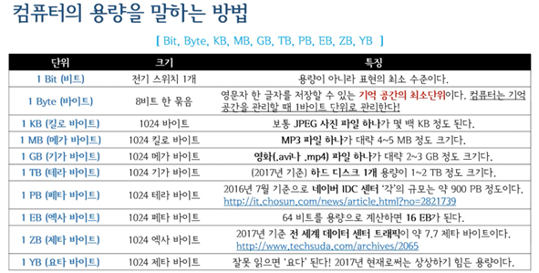

## 1비트에서 진법변환까지

 

### 1bit
- 1비트란 '전기 스위치 1개'를 의미한다
- 전기가 흐르는 상태는 1, 흐르지 않는 상태는 0
- 여러 비트를 조합함으로써 큰 수를 표현할 수 있다. 예로는 4비트는 0~2**4-1까지 표현

### 진법변환
1001 -> 2**3 * 1 + 2\*\*2 * 0 + 2\*\*1 * 0 + 2\*\*0 * 1 = 9
- 이렇게 이진수를 십진법으로 변환

### 1bit와 4GB
- *8개 비트*를 하나로 묶어 **1바이트(Byte)** 라고 한다
- 1바이트는 영문자 한 글자가 저장할 수 있는 메모리 크기다.(한글 한 글자를 저장하려면 2바이트가 필요하다)
- 2의 10제곱은 **1024**
- *2의 32 제곱*은 약 42.9억으로 **4GB**이다
- 2의 32 제곱은 **32bit**를 의미한다. 즉 *32비트 구조의 한계 용량은 4GB이다*
- <u>4비트는 16가지, 8비트는 256가지, 16비트는 65,536가지(64kb)이다</u>

### 컴퓨터 용량

 

##### 참고: '널널한 개발자' 유튜브 강의