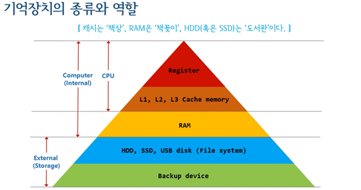
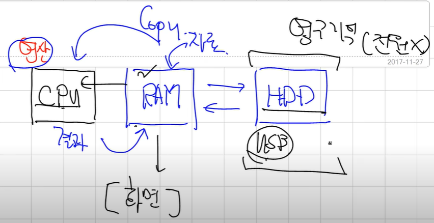

## 기억장치

 

기억장치 : 정보, 자료를 담아두는 공간
- 주기억장치, 보조기억장치로 나뉨
- 공간 마다 속도, 휘발성 다름

- 피라미드 꼭대기로 갈수록 속도가 빨라지고
- 피라미드 아래로 갈수록 저장용량이 늘어남(cpu(byte, mb), ram(gb), hd(tb) ...)
- cpu, ram은 주기억장치, 하드디스크는 보조기억장치

 

기억장치 흐름도

- CPU에서 연산 -> 연산을 위해 RAM 내 자료, 정보를 CPU에 가져와야 함 -> 연산 뒤 결과를 RAM에 보냄
- RAM은 보조기억장치 정보를 가져와서 CPU에 가져다 줌
- HDD가 정보를 빨리 가져오기 위해 캐시에서 가져옴
    - 캐시는 책의 목록같은 인덱스와 같다
- 연산은 레지스터에서 일어남 -> 연산 하기 위해서 RAM 이하의 정보를 CPU쪽으로 가져와야 함

 

- CPU가 RAM을 관리한다 

관리 체계
- 레지스터: 고유 이름
- 주기억장치: 일련번호
- 보조기억장치: 트랙번호, 섹터번호
트랙 + 섹터
- 하드디스크 정보 위치(몇 번 트랙, 몇 번 섹터의 A를 가져와라)
연산과정
- HDD의 1번 트랙 4번 섹터로 가서 그 안의 정보를 RAM으로 가져옴 -> 그 정보를 RAM메모리의 15번에 저장 -> 그 정보를 CPU내의 EAX레지스터에 가져와서 저장